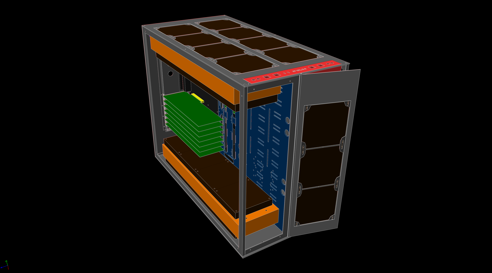

# NPW-1.0
NPW-1.0 is a HUGE PC case with tempered glass front and side panels. It fits two motherboards up to SSI EEB with 8 PCIe slots each, lots of water cooling gear, HDDs and other hardware.

Main external links:
* [Original sketch in Tinkercad](https://www.tinkercad.com/things/5POLrxztfuo)
* [Final 3D model in SolveSpace](https://nazar-pc.github.io/NPW-1.0)
* [forum.overclockers.ua](https://forum.overclockers.ua/viewtopic.php?f=7&t=192889) describing the journey (in Ukrainian)
* [Live 3D view of the model](https://nazar-pc.github.io/NPW-1.0)

## Motivation

It was built as a hobby project out of desire to combine main workstation with x86-64-based router/AP into a single case and have more space for hardware expansion than in serial products.

The closest to what I wanted were CaseLabs products and some big Corsair/Phanteks cases, but they all made compromises I didn't like.

In retrospective this was much bigger project than I expected, took a lot more time and money than predicted, but I enjoyed the result and use it for over 3 years as of writing this text.

## Key specs

* Physical size ~700x550x360mm without feet
* Dual SSI EEB motherboards with 8 PCIe slots each
* 3x 560mm water cooling radiators up to 55mm with standard 25mm fans on both sides (12 to 24 140mm fans in total)
* 3x 140mm additional intake fans on the front panel
* Up to 12 5.25'' ODD slots that can be used to host HDDs, SSDs and other hardware with adapters (typically 3D-printed)
* Mounting holes and slots for dual vertical 250mm reservoirs and dual water cooling pumps
* Support for one ATX PSU of any size, including the most ridiculous possible
  * Phanteks Revolt X 1000/1200 is recommended as this is the only PSU that can support dual motherboards that can independently turn on and off
* Front panel with 8 USB Type-A 3.0 ports (4 for each system) and two additional USB Type-C ports for the workstation
* Back panel hosts up to 4 Wi-Fi SMA connectors for external 2.4G/5G antennas for Access Point needs
* Tempered glass side panels and half of the front of the case
* The other half of the front is the door allowing access to hot swap HDDs or for other needs
* RGB LED backlight on both sides
* Tool-less side panel opening with knurled thumb screws, countersunk hex screws for everything else
* Cable management openings and mounting holes between two systems

## Repository structure

* `initial-build-pictures` has real-world pictures of the initially assembled system
* `manufacturing` contains various unorganized assets related to the manufacturing process, including sheet metal materials, though they have a few minor mistakes that are not present in the below 3D model and I honestly wasn't able to put together one final version with all fixed done (though it is unlikely anyone would manufacture it again the same exact way anyway)
* `renders` contains both rendering pictures from various angles as well as STEP model and HTML version of the model that can be also [seen live](https://nazar-pc.github.io/NPW-1.0)
* `src` is the most important piece, it contains both low-level components (like motherboard and PSU wireframes with correct relative sizes) as well as assemblies of components all the way up to `case.slvs` that puts everything into the final model
  * be careful, `case.slvs` is pushing the boundaries of what SolveSpace can do and is slow to open and manipulate

## History

The original journey as it happened can be found on [forum.overclockers.ua](https://forum.overclockers.ua/viewtopic.php?f=7&t=192889) (in Ukrainian), this is a short digest of it in English.

Everything started with a [mockup in Tinkercad](https://www.tinkercad.com/things/5POLrxztfuo) in the first half of 2018, that was the time when I was fairly confident I want a case like that.
Tinkercad was chosen because I had zero experience with modeling of anything like that.

Tinkercad was very basic though and I needed something more serious, which is where I found amazing Open Source parametric 3D CAD software called [SolveSpace](https://solvespace.com).
From there I went to remodeling everything using ATX and other specifications from the ground up using SolveSpace.
Everything is perfectly measured and aligned with combination of metric and imperial units, as in corresponding standards.

By the middle of 2018 I had some prototypes and around Q3 2018 I had final-ish design.

Turned out it is not possible to just cut and bend aluminium from those models the way I anticipated, so I hired a specialist that turned my precise design into sheet metal model in SolidWorks.
In Q1 2019 I had some parts cut laser cut.

Bending and painting was difficult with a lot of time spend and a lot of frustration (not to say cost) and re-doing due to fuck-ups during manufacturing that were not my fault.

Anyway, after some pieces re-done again by Q2 2019 I had case pieces painted and delivered, including tempered glass panels. Started assembling it.

By Q3 2019 I had water cooling components, magnetic dust filters and moved my workstation components into still WIP case.

I Q4 2019 I have posted "final" build photos on the forum 🎉.

## License

[Creative Commons - Attribution-NonCommercial-ShareAlike 4.0 International (CC BY-NC-SA 4.0)](https://creativecommons.org/licenses/by-nc-sa/4.0/)

If you'd like to make a serial product based on this design I'd be happy to assist, feel free to DM me, I'm not hard to find.
